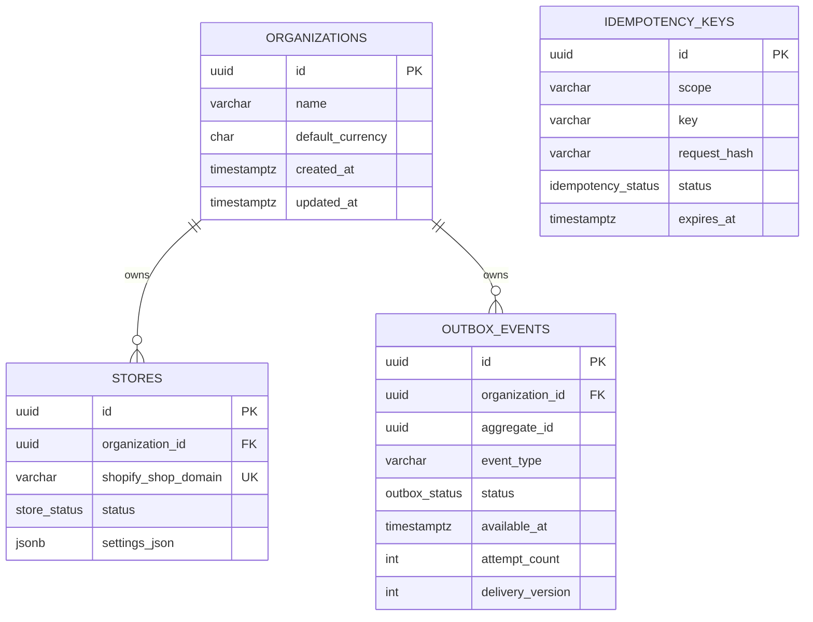

# Arquitectura de persistencia inicial

Prisma 7.8.0 genera un cliente tipado en `apps/api/src/generated/prisma`, excluido de Git y regenerado
durante build y pruebas. `@prisma/adapter-pg` utiliza el driver PostgreSQL existente. La URL se
construye desde `POSTGRES_*`; `DATABASE_URL` puede sobrescribirla para pruebas aisladas.

La migración versionada es la fuente de estructura. `db push` no se usa porque omite el historial
revisable. Los checks SQL protegen invariantes incluso frente a escrituras fuera de Prisma.
