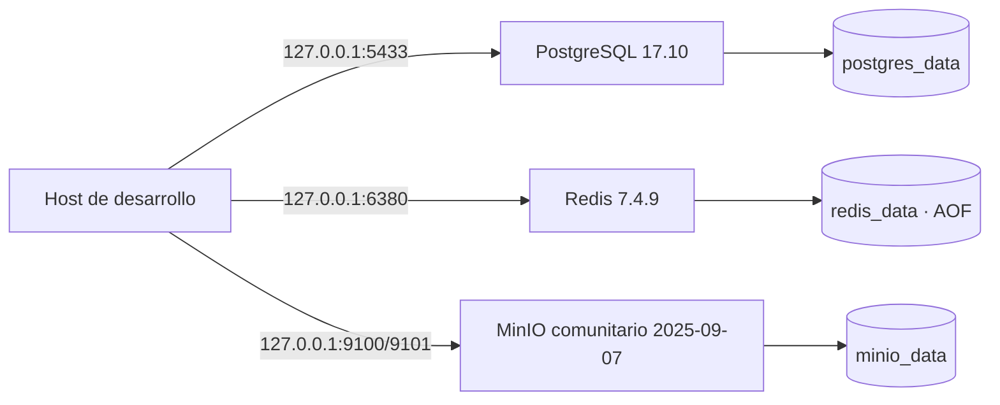

# Infraestructura local E0-H2

Los servicios comparten únicamente la red bridge privada `backend`. Los puertos publicados se ligan
a `127.0.0.1`, no a todas las interfaces. Las credenciales se generan localmente en `.env`, archivo
excluido de Git.

Esta vertical no conecta todavía la API a las dependencias. Prisma, migraciones, outbox y BullMQ
pertenecen a E0-H3/E0-H4.
