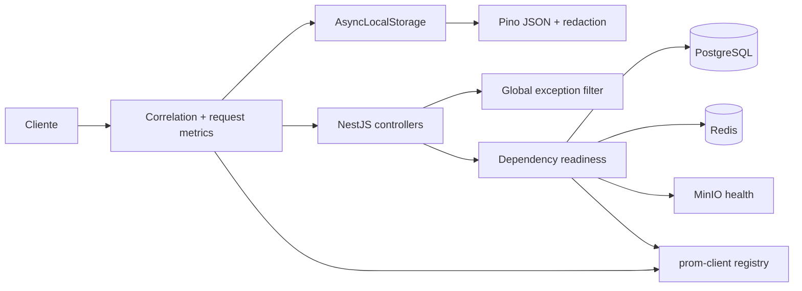

# Arquitectura de observabilidad E0-H3

Invariantes:

1. Los logs no incluyen body, query string, headers de autenticación ni cookies.
2. Los errores públicos 5xx no incluyen stack ni detalle interno.
3. Las métricas usan patrones de ruta para evitar cardinalidad no acotada.
4. Liveness no depende de infraestructura; readiness sí.
5. Cada dependencia tiene timeout y la caída de una no impide evaluar las demás.
6. OpenTelemetry queda pendiente para una vertical posterior; no se simulan traces.
