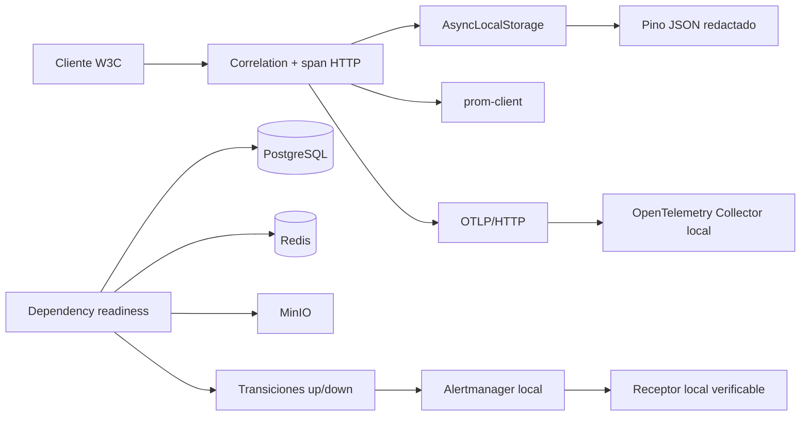

# Arquitectura de observabilidad E0-H3/E0-H3B

La API extrae y propaga `traceparent` W3C. Cada request crea un span de servidor de baja cardinalidad,
devuelve `x-trace-id`/`x-span-id` e incorpora ambos identificadores a los logs dentro de su contexto.
El exportador OTLP usa HTTP, timeout acotado y muestreo configurable; sus fallos nunca cambian el
resultado HTTP de negocio.

El Collector local recibe OTLP por `4318`, procesa por lotes y escribe spans en su exportador de
depuración. Es un backend verificable de desarrollo, no un almacén persistente de trazas ni una
afirmación de preparación productiva.

Readiness evalúa PostgreSQL, Redis y MinIO. `AlertingService` observa únicamente cambios de estado:
el primer estado sano establece baseline, `up -> down` envía una alerta activa y `down -> up` la
resuelve. Estados repetidos no vuelven a notificar. Alertmanager agrupa/deduplica y entrega a un
receptor local que conserva solo estado y timestamp, nunca el payload completo.

Invariantes:

1. Logs, spans, alertas y métricas no incluyen bodies, query strings, headers de autenticación,
   cookies, PII, IDs externos ni contenido de mensajes.
2. Los errores públicos 5xx no incluyen stack ni detalle interno.
3. Traces y métricas usan método, patrón de ruta, estado y nombres de dependencia acotados.
4. Liveness no depende de infraestructura; readiness sí.
5. Cada dependencia, exportador y destino de alertas tiene timeout.
6. Una caída de Collector, Alertmanager o receptor no tumba la API ni falsea readiness.
7. Trazas y alertas tienen flag y kill switch; permanecen apagadas por defecto.
8. `/metrics` es loopback por defecto y exige Bearer técnico en producción.
