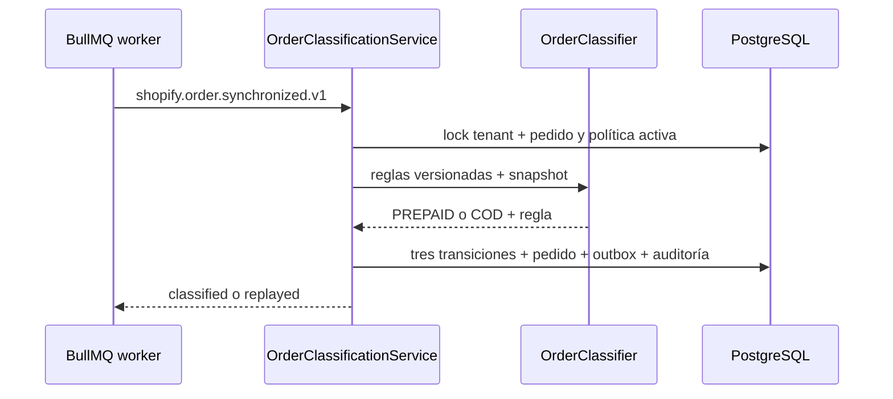
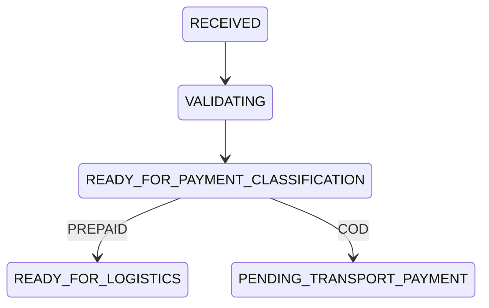

# Clasificación de pago de pedidos

Estado: E1-H4A implementada únicamente en simulación.

## Flujo

La política es independiente del proveedor y se versiona por tienda. Sus reglas tienen prioridad
explícita y pueden combinar `financial_status`, tags o gateways. La mayor prioridad decide; dos modos
distintos con la misma prioridad, una política inválida o la ausencia de coincidencia fallan cerrado.

## Máquina de estados del corte

Cada arista se persiste en `order_state_history`. Un trigger de PostgreSQL impide `UPDATE` y
`DELETE`. El estado fuente se verifica con política default-deny y el mismo evento no duplica
transiciones ni `order.classified.v1`.

## Límites

- Solo reglas y evidencia sintéticas; no hay heurísticas productivas implícitas.
- No hay API/UI para editar o activar políticas; se entrega una política v1 al registrar la tienda.
- No inicia Wompi, WhatsApp, Mastershop ni fulfillment.
- Flags apagados y kill switch activo por defecto.
