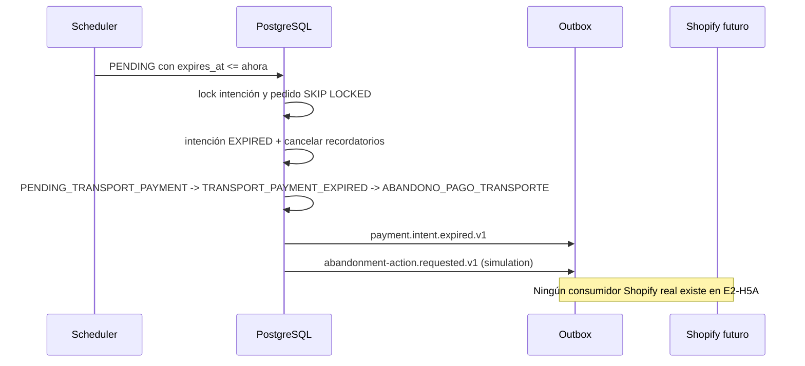

# Vencimiento y abandono de pago

E2-H5A procesa intenciones Wompi `PENDING` al alcanzar `expires_at`, equivalente a 24 horas en la
configuración contractual actual. La acción `MARK` o `CANCEL` se copia a cada intención al crearla;
así un cambio de configuración no reescribe decisiones históricas. `MARK` es el valor seguro por
defecto mientras la decisión DP-002 permanezca abierta.

Todas las escrituras ocurren en una transacción. El scheduler y el webhook bloquean primero la misma
fila de intención; una aprobación simultánea gana antes del vencimiento o, si llega después de que la
intención quedó terminal, se registra como tardía sin reescribirla. Una aprobación tardía posterior al
vencimiento lleva el pedido a `MANUAL_REVIEW` y emite evidencia para operación.

`CANCEL` solo crea una solicitud simulada. El estado interno permanece
`ABANDONO_PAGO_TRANSPORTE`; `CANCELLED` se reserva para una confirmación real futura de Shopify.

## Rollback

Desactive `PAYMENT_EXPIRATION_ENABLED` o active el kill switch. La migración es expand-only; no
elimine enum values, columnas ni historiales. Revertir datos de negocio requiere revisión humana y
una migración compensatoria.
