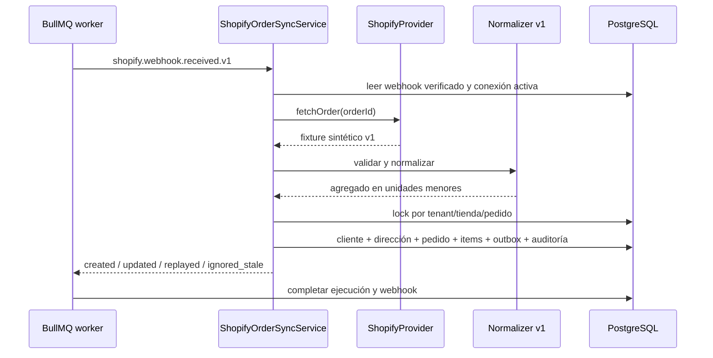

# Sincronización de pedidos Shopify

Estado: E1-H3A implementada únicamente en simulación.

## Flujo

El identificador técnico del pedido se extrae solo después de validar el HMAC. El cuerpo crudo del
webhook no se persiste. El worker vuelve a consultar el pedido por `ShopifyProvider`; el mock usa un
fixture versionado y el futuro adaptador real deberá mantener el mismo límite.

## Invariantes

- Ownership compuesto `organization_id + store_id` en clientes, direcciones, pedidos e items.
- Un pedido por `(store_id, shopify_order_id)` y un efecto por webhook de origen.
- Dinero como `BIGINT` en unidades menores; nunca `float`.
- Transacción serializable y advisory lock por tenant/tienda/pedido.
- Un snapshot con `source_updated_at` igual o anterior no reemplaza una versión más nueva.
- Cliente, dirección e items se actualizan mediante claves externas estables sin duplicarse.
- El agregado y `shopify.order.synchronized.v1` se confirman en la misma transacción.
- `payment_mode=unclassified` y `current_state=received`; la clasificación pertenece a E1-H4.

## Límites actuales

- Solo fixture sintético v1, una moneda de dos decimales y `orders/create`.
- No existe consulta HTTP de pedidos ni conexión Shopify real.
- No se interpretan todavía estados financieros, COD, cancelaciones ni fulfillment.
- El snapshot completo solo contiene datos sintéticos. Antes de datos reales se debe aprobar la
  política de retención, acceso y protección de PII.
