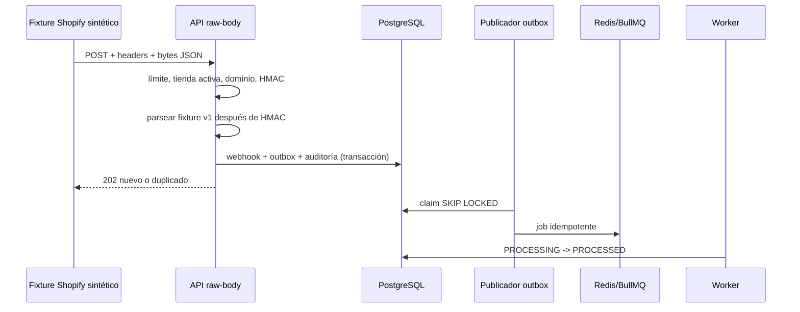

# Ingreso de webhooks Shopify

## Alcance E1-H2A

Esta vertical recibe exclusivamente fixtures sintéticos `orders/create`. No registra suscripciones,
no llama Shopify y no crea pedidos de dominio.

## Invariantes

- Correlación se instala antes del parser; los 413 también son trazables.
- Solo una tienda y conexión Shopify activas, con dominio coincidente, pueden recibir.
- HMAC usa los bytes exactos y comparación constante; JSON se interpreta después.
- Solo `orders/create` y fixture `_fixture.synthetic=true`, versión `v1`.
- Unicidad durable por tienda, topic e ID de entrega.
- La respuesta HTTP no espera Redis ni al worker.
- PostgreSQL conserva hash, headers redactados y resumen; nunca HMAC, secreto ni payload completo.
- El outbox incluye IDs internos y metadata acotada, sin PII.

La estructura y el HMAC siguen las cabeceras oficiales documentadas por Shopify:
[delivery structure](https://shopify.dev/docs/apps/build/webhooks/delivery-structure) y
[verification](https://shopify.dev/docs/apps/build/webhooks/verify-deliveries).
