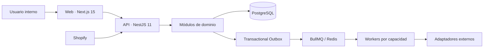

# Arquitectura inicial

En E0-H1 solo están implementadas las cajas Web y API. Base de datos, outbox, colas, workers y
adaptadores son objetivos posteriores y no deben interpretarse como disponibles.
