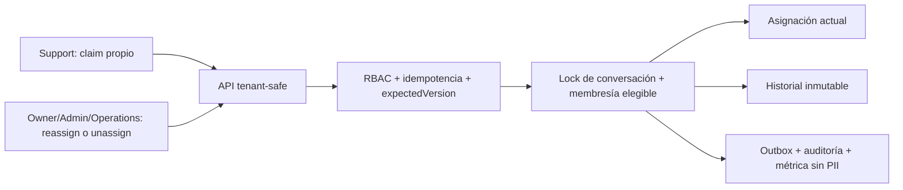

# Arquitectura E3-H7A — asignación WhatsApp simulada

Actualizado: 2026-07-17

E3-H7A agrega ownership operativo a la bandeja simulada sin responder mensajes ni conectar Meta.
La asignación actual vive en la conversación y cada cambio genera una versión histórica inmutable.

## Modelo

- `WhatsAppConversation.assignedMembershipId` referencia una membresía del mismo tenant.
- `assignmentVersion` inicia en cero y aumenta una vez por cambio efectivo.
- `assignedAt` indica cuándo quedó vigente la asignación actual.
- `WhatsAppConversationAssignmentHistory` conserva actor, agente anterior/nuevo, acción, razón
  acotada, versión y timestamp. Un trigger impide actualizar o borrar evidencia.

## Escritura concurrente

Cada comando exige `Idempotency-Key` y `expectedVersion`. La transacción serializable bloquea la
conversación, valida la versión y la membresía objetivo, actualiza el estado, inserta historial,
outbox y auditoría de forma atómica. El mismo request se reproduce; una reutilización con contenido
distinto falla y dos claims concurrentes no pueden ganar.

## Elegibilidad y privacidad

La API solo acepta IDs de membresía `ACTIVE` cuyo usuario también esté `ACTIVE`, dentro de la misma
organización y con rol `SUPPORT`, `OPERATIONS`, `ADMIN` u `OWNER`. Listado, respuestas operativas,
outbox, auditoría y métricas omiten email, teléfono, cuerpo de mensajes e identificadores externos.
