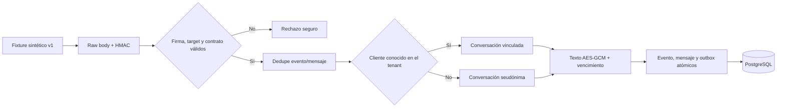

# Arquitectura E3-H5A — mensajes entrantes WhatsApp simulados

El servicio usa una transacción serializable y locks advisory por mensaje externo y contacto. El
índice tienda/evento resuelve reentregas; el identificador de proveedor único evita duplicar un
mensaje cuando cambia el ID de entrega. Una colisión de contenido falla cerrada.

La identidad se resuelve únicamente dentro de organización y tienda. Para contactos desconocidos,
el HMAC usa el keyring versionado de WhatsApp, no el secreto del webhook. Al rotar la clave, se
comparan los seudónimos calculados con las versiones conservadas y la conversación se actualiza a la
versión actual. Perder una clave histórica impide esa continuidad, igual que impide descifrar
contenido cifrado con ella.

El mensaje inbound es `text/simulated_received`; no tiene pedido, plantilla ni cuerpo en claro. El
evento inbound y ambos artefactos de evidencia son inmutables. Un outbox
`whatsapp.message.simulated-received.v1` habilita la futura bandeja E3-H6A sin responder al cliente ni
invocar Meta.
