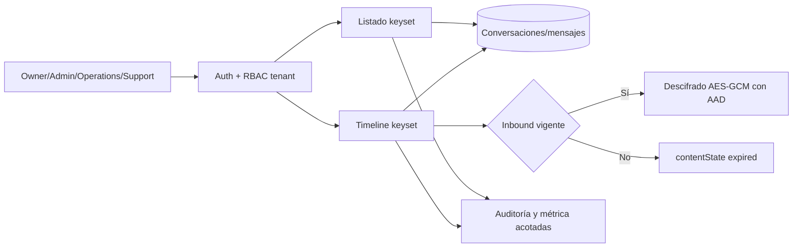

# Arquitectura E3-H6A — bandeja WhatsApp simulada

La bandeja es una proyección de lectura sobre los artefactos durables de E3-H3A a E3-H5A; no crea
tablas ni muta conversaciones. Los cursores codifican timestamp e ID para mantener desempate estable
y todas las consultas vuelven a fijar organización, tienda y conversación, por lo que un cursor no
puede ampliar el tenant.

El listado nunca carga cuerpos cifrados. El timeline selecciona el contenido solo después de validar
RBAC y ownership, y decide vencimiento antes de descifrar. El historial de estado se muestra con IDs
internos omitidos. Las lecturas emiten auditoría/Prometheus con operación, resultado, filtros e
itemCount acotados; no emiten outbox porque no cambian estado.
