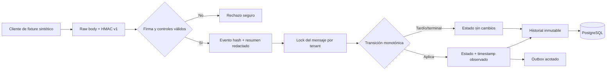

# Arquitectura E3-H4A — estados WhatsApp simulados

El ingreso es síncrono y local porque no invoca proveedores ni trabajo prolongado: verifica,
serializa el mensaje y persiste evento/historial/outbox en una transacción serializable. El índice
`store_id + external_event_id` deduplica entregas; el lock de fila hace determinista la carrera entre
`sent` y `delivered` y evita regresiones.

`simulated_read` y `simulated_failed` son terminales. El historial conserva tanto transiciones
aplicadas como observaciones ignoradas. Un mensaje desconocido conserva evidencia redactada sin
revelar si un identificador pertenece a otro tenant.
