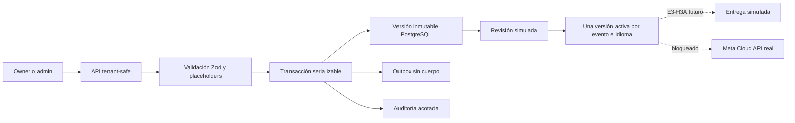

# Arquitectura E3-H2A — plantillas WhatsApp simuladas

El `templateKey` representa la identidad lógica y `version` su contenido histórico. Un trigger impide
editar identidad, cuerpo, variables, evento o idioma; solo estado de revisión y activación cambian.
Un advisory lock serializa cada identidad y una restricción parcial impide dos versiones activas para
el mismo evento/idioma/tienda.

Los controles `WHATSAPP_TEMPLATES_ENABLED`, `WHATSAPP_TEMPLATES_KILL_SWITCH` y
`WHATSAPP_TEMPLATES_SIMULATION_MODE` fallan cerrados por defecto y son independientes del canal.
