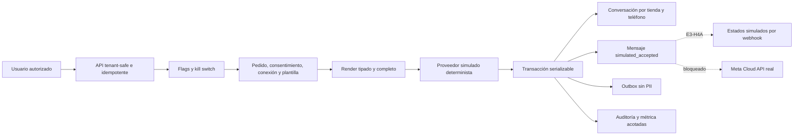

# Arquitectura E3-H3A — mensajería transaccional simulada

La clave de efecto se deriva de organización, tienda, evento, pedido y versión de plantilla. Un advisory
lock y una restricción única evitan duplicados entre claves HTTP concurrentes. La conversación se
serializa por tienda/teléfono y no admite reasignar un número a otro cliente.

El cuerpo renderizado queda en el mensaje durable para trazabilidad funcional, mientras auditoría,
respuesta, métricas y outbox conservan solo metadatos. El estado v1 es deliberadamente único:
`SIMULATED_ACCEPTED`. Los tiempos reales `sent`, `delivered`, `read` y `failed` permanecen nulos.

El proveedor inyectado es un mock local sin red. Antes de vincular Meta, la llamada externa debe salir
de la transacción de base y ejecutarse mediante un worker/outbox con reintentos acotados.
